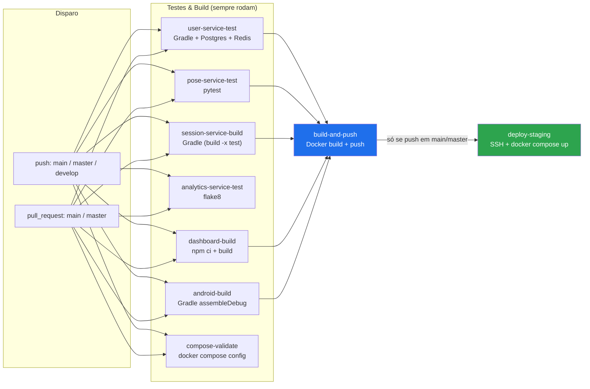
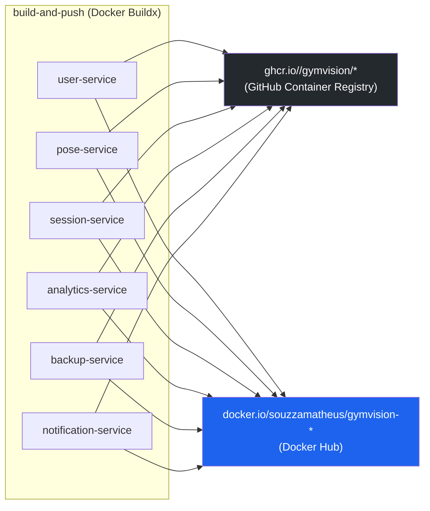
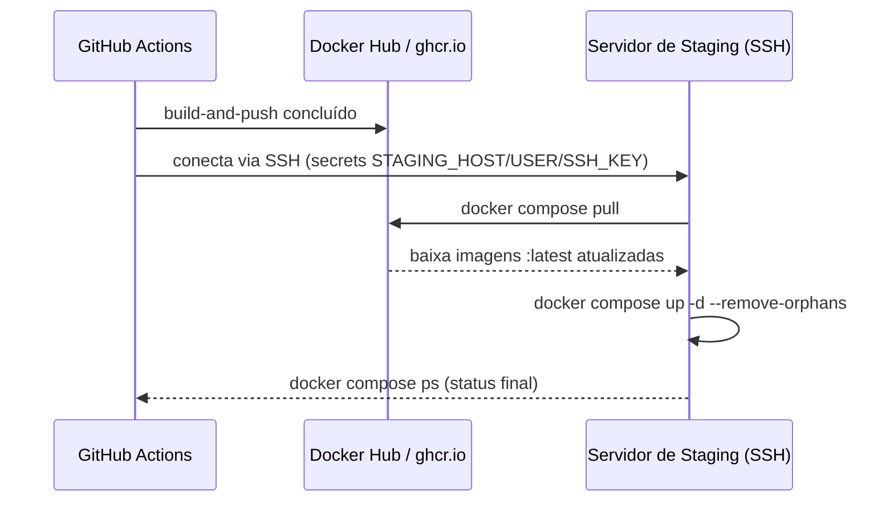
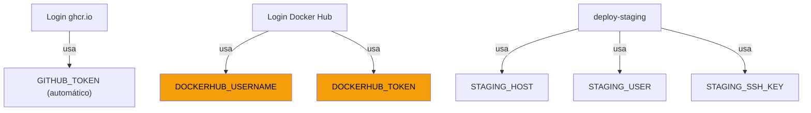

# CI/CD — GymVision (versão visual)

Complemento ilustrado de [`CI_CD.md`](CI_CD.md) (que tem as tabelas detalhadas). Os diagramas abaixo são [Mermaid](https://mermaid.js.org/) — o GitHub renderiza automaticamente como imagem ao visualizar este arquivo no repositório.

## 1. Disparo e dependência entre jobs

`analytics-service-test` e `compose-validate` rodam sempre, mas não bloqueiam `build-and-push` (não estão no `needs:`). Se algum dos outros 5 falhar, a publicação não acontece.

## 2. Para onde vão as imagens

`dashboard` (build estático) e `android-app` (gera `.apk`) não entram aqui — não são publicados como imagem Docker.

## 3. Deploy em staging

## 4. Secrets exigidos por etapa

`DOCKERHUB_USERNAME` e `DOCKERHUB_TOKEN` (em destaque) ainda não foram configurados no repositório — sem eles, o job `build-and-push` falha no login do Docker Hub.
